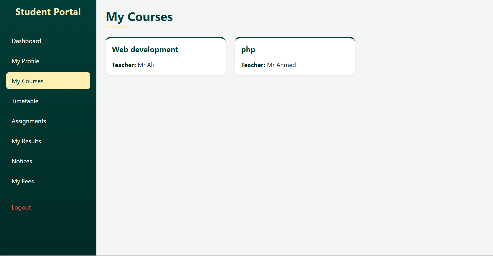
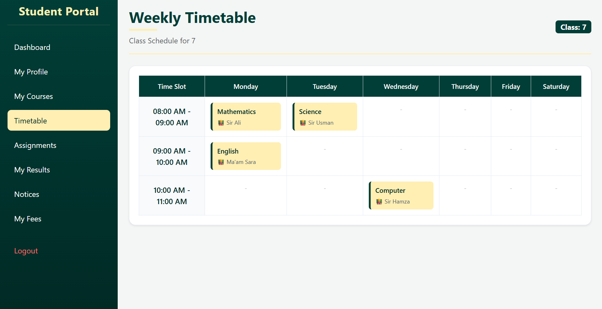

# 🎓 Forces Academy LMS

A full-stack Learning Management System (LMS) built with PHP and MySQL, developed during the Code Saviours Full Stack Internship. It provides students and administrators with a complete platform to manage courses, assignments, results, notices, fees, and timetables — all through role-based dashboards.

## 🌐 Live Demo

**Website:** [forcesacademy.xo.je/forces-academy-lms](http://forcesacademy.xo.je/forces-academy-lms/)

| Portal | Link |
|---|---|
| Student Login | [/login.php](http://forcesacademy.xo.je/forces-academy-lms/login.php) |
| Admin Login | [/admin/login.php](http://forcesacademy.xo.je/forces-academy-lms/admin/login.php) |

## 📸 Screenshots

| Student Dashboard | Admin Dashboard |
|---|---|
|  |  |

| My Courses | Timetable |
|---|---|
|  |  |

> Replace the image paths above with the actual screenshot files stored in a `/screenshots` folder in your repo.

## 🛠️ Tech Stack

**Frontend**
- HTML5
- CSS3
- Bootstrap 5
- JavaScript

**Backend**
- PHP

**Database**
- MySQL

**Tools**
- Visual Studio Code
- XAMPP
- phpMyAdmin
- Git & GitHub

**Hosting**
- InfinityFree

## ✨ Features

### 👨‍🎓 Student Portal
- Student registration and login
- Personalized student dashboard
- View enrolled courses
- View notices and announcements
- View, submit, and upload assignment files
- View results and grades
- View fee records and pending dues
- View class timetable
- Manage and edit profile
- Secure session-based authentication

### 🛡️ Admin Portal
- Secure admin login
- Centralized admin dashboard with live stats
- Manage students (add, view, edit, remove)
- Manage courses
- Post and manage notices
- Manage assignments
- Upload and manage student results
- Manage fee records
- Manage class timetable

### ⚙️ System Features
- Role-based access control (Student / Admin)
- MySQL database integration
- PHP session management
- Secure password hashing (`password_hash` / `password_verify`)
- Prepared SQL statements to prevent SQL injection
- File upload functionality for assignments
- Fully responsive interface (mobile, tablet, desktop)
- Deployed and accessible online

## 🗄️ Database Schema

Database name: `forces_academy_lms`

| Table | Purpose |
|---|---|
| `admins` | Admin account credentials |
| `students` | Student account and profile data |
| `courses` | Course catalog |
| `notices` | Announcements posted by admin |
| `assignment` | Assignments created by admin |
| `submissions` | Assignment submissions by students |
| `results` | Student results/grades |
| `fees` | Student fee records |
| `timetable` | Class schedule |

## 🚀 How to Run Locally

### 1. Install XAMPP
Download and install [XAMPP](https://www.apachefriends.org/), then start:
- Apache
- MySQL

### 2. Clone the Repository
```bash
git clone YOUR_GITHUB_REPOSITORY_URL
cd forces-academy-lms
```

### 3. Move Project to htdocs
Copy the project folder into your XAMPP `htdocs` directory:
```
C:/xampp/htdocs/forces-academy-lms
```

### 4. Create the Database
- Open **phpMyAdmin** (`http://localhost/phpmyadmin`)
- Create a new database named `forces_academy_lms`
- Import the provided SQL file (e.g. `forces_academy_lms.sql`) from the project folder

### 5. Configure Database Connection
Open `config/db.php` and update the credentials if needed:
```php
$conn = mysqli_connect("localhost", "root", "", "forces_academy_lms");
```

### 6. Run the Project
Open your browser and visit:
```
http://localhost/forces-academy-lms/
```

## 👤 Built By

**[Moaza]**
Code Saviours — SI-26 | 2026
